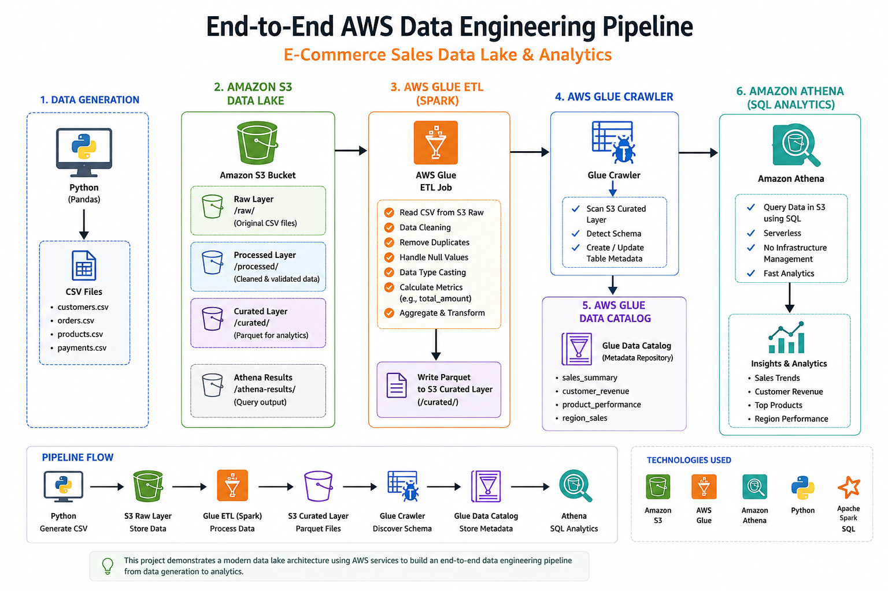
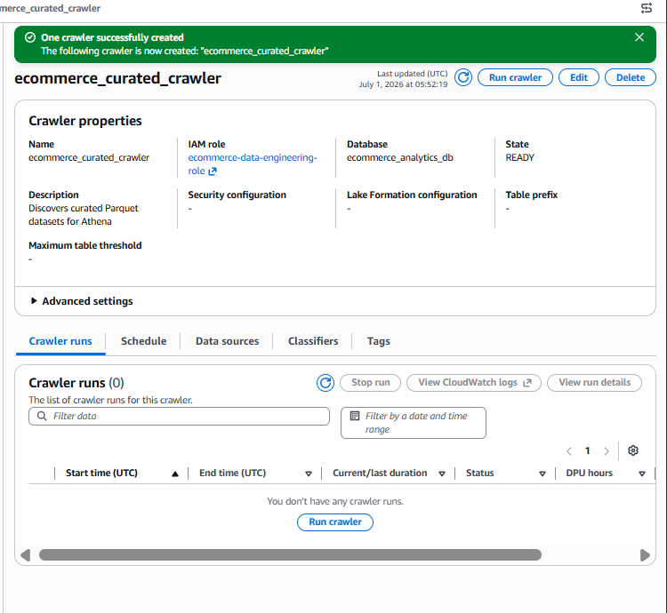

# E-Commerce Sales Data Lake & Analytics Pipeline

An end-to-end AWS Data Engineering project that demonstrates how raw e-commerce sales data can be ingested, transformed, cataloged, and queried using serverless AWS services.

The pipeline uses **Amazon S3**, **AWS Glue (Apache Spark)**, **Glue Data Catalog**, **Glue Crawlers**, and **Amazon Athena** to build a modern cloud-based data lake.

---

#  Project Architecture



---

# Project Overview

This project simulates a real-world e-commerce analytics pipeline.

Raw CSV datasets are stored in Amazon S3. An AWS Glue ETL job built with Apache Spark cleans and transforms the data before storing it as optimized Parquet datasets. AWS Glue Crawlers automatically discover the schema and register the datasets in the Glue Data Catalog. Finally, Amazon Athena is used to perform SQL analytics directly on data stored in Amazon S3.

---

# Architecture Flow

```
Python (Pandas)
        │
        ▼
Generate CSV files
        │
        ▼
Amazon S3 (Raw Layer)
        │
        ▼
AWS Glue ETL Job
        │
        ▼
Apache Spark Transformations
        │
        ▼
Parquet Files
        │
        ▼
AWS Glue Crawler
        │
        ▼
Glue Data Catalog
        │
        ▼
Amazon Athena
        │
        ▼
SQL Analytics
```

---

# AWS Services Used

| Service | Purpose |
|----------|----------|
| Amazon S3 | Stores raw and curated datasets |
| AWS Glue | Runs ETL jobs |
| Apache Spark | Distributed data processing engine used by Glue |
| Glue Data Catalog | Stores dataset metadata |
| Glue Crawler | Automatically discovers dataset schema |
| Amazon Athena | Performs SQL queries on S3 data |

---

# Project Structure

```
ecommerce-data-lake-project/

├── architecture/
│   └── aws_data_pipeline_architecture.png
│
├── data/
│   ├── customers.csv
│   ├── orders.csv
│   ├── payments.csv
│   └── products.csv
│
├── glue/
│   ├── ecommerce_sales_etl_job.py
│   └── ecommerce_sales_etl_job.json
│
├── notebooks/
│   └── data_generation.ipynb
│
├── screenshots/
│   ├── s3_bucket_structure.png
│   ├── glue_job_configuration.png
│   ├── glue_job_settings.png
│   ├── glue_crawler.png
│   ├── glue_data_catalog.png
│   └── athena_query_results.png
│
├── sql/
│   └── athena_queries.sql
│
├── README.md
└── LICENSE
```

---

# Amazon S3 Data Lake

## Raw Layer

Contains original CSV files uploaded into S3.

```
raw/

customers/
orders/
payments/
products/
```

---

## Curated Layer

Contains optimized Parquet datasets produced by the Glue ETL job.

```
curated/

customer_revenue/
product_performance/
region_sales/
sales_summary/
```

---

# ⚙ ETL Pipeline

The Glue ETL job performs the following operations:

- Reads CSV files from Amazon S3
- Removes duplicate records
- Removes records with missing primary keys
- Converts string columns into numeric data types
- Calculates total sales amount
- Joins customer and order datasets
- Generates business analytics datasets
- Writes optimized Parquet datasets back to Amazon S3

---

# Generated Analytics

The ETL job produces four analytics datasets:

### Sales Summary

Daily revenue generated.

---

### Customer Revenue

Revenue generated by each customer.

---

### Product Performance

Sales generated by each product.

---

### Region Sales

Revenue grouped by customer region.

---

# 🗄 Glue Data Catalog

AWS Glue Crawlers automatically scan the curated Parquet files and register them as queryable tables inside the Glue Data Catalog.

Generated tables:

- sales_summary
- customer_revenue
- product_performance
- region_sales

---

# Amazon Athena

Athena is used to query the curated Parquet datasets directly from Amazon S3 without managing any database servers.

Example queries:

```sql
SELECT *
FROM sales_summary;
```

```sql
SELECT *
FROM customer_revenue
ORDER BY customer_revenue DESC;
```

```sql
SELECT *
FROM region_sales
ORDER BY region_revenue DESC;
```

---

# Project Screenshots

## Amazon S3 Bucket


---

## AWS Glue Job Configuration


---

## AWS Glue Crawler



---

## Glue Data Catalog


---

## Amazon Athena Queries


---

# Key Concepts Demonstrated

- Data Lake Architecture
- ETL Pipelines
- Apache Spark Transformations
- AWS Glue Jobs
- Data Cleaning
- Data Aggregation
- Parquet Format
- Glue Crawlers
- Glue Data Catalog
- Serverless Analytics
- Amazon Athena
- SQL Analytics

---

# Skills Demonstrated

- Python
- Pandas
- SQL
- Apache Spark
- AWS Glue
- Amazon S3
- AWS Glue Crawlers
- Glue Data Catalog
- Amazon Athena
- Data Engineering
- Cloud Computing
- ETL Pipeline Design

---

# Future Enhancements

- Automate ETL using AWS Lambda triggered by S3 uploads
- Schedule Glue jobs using EventBridge
- Build interactive dashboards using Amazon QuickSight
- Implement incremental ETL processing using Glue Job Bookmarks
- Add data quality validation before loading curated datasets

---

# Author

**Aliya Salim**

Software Engineer | Data Engineer
